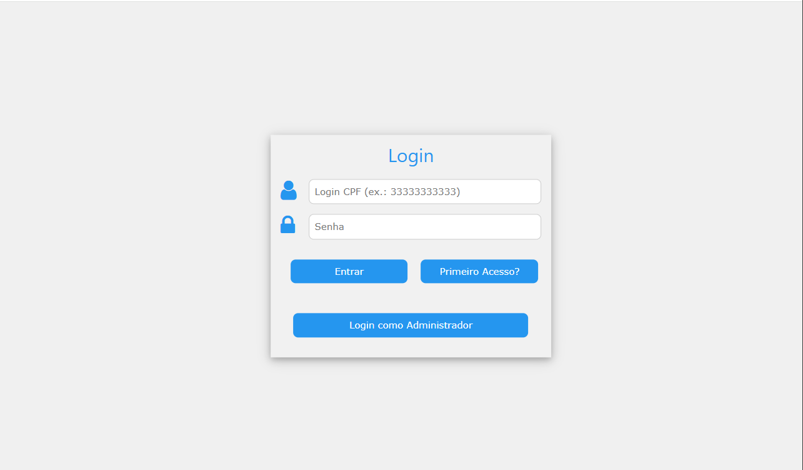
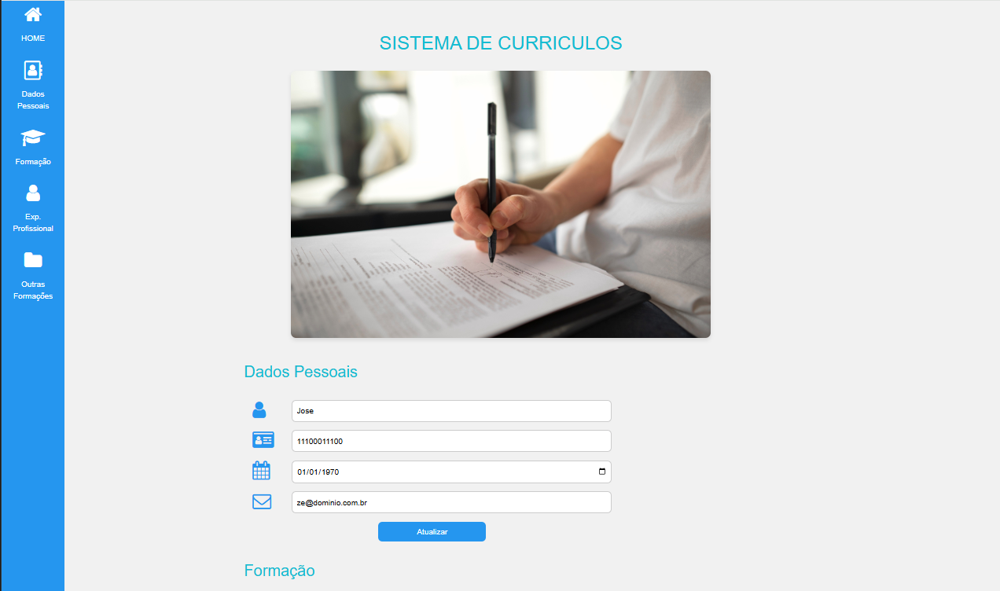
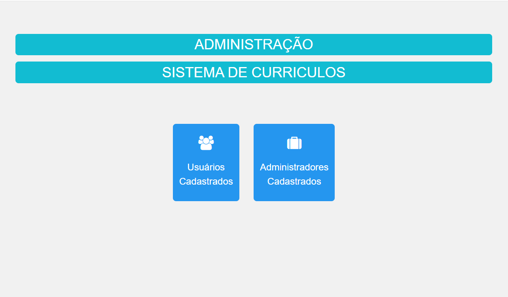
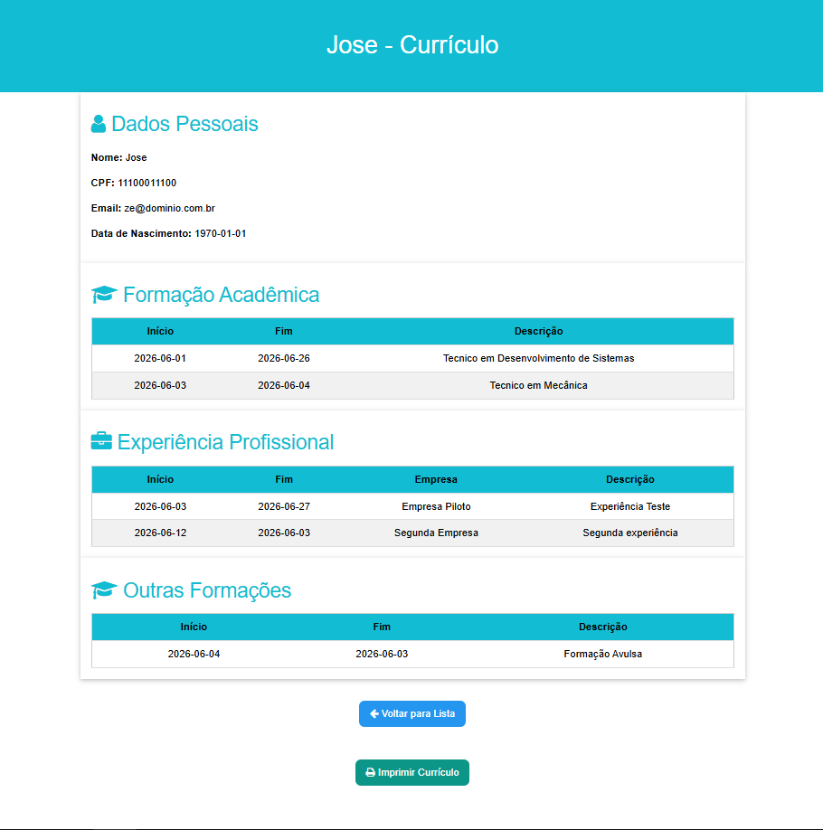

# Agenda 14 - DS3

## 👤 Sobre Este Projeto

Olá! Sou desenvolvedor(a) e criei este **Sistema de Gestão de Currículos** como parte do curso de **Desenvolvimento de Sistemas III**. Este projeto representa a culminação de quatro agendas de desenvolvimento (Agendas 11, 12, 13 e 14), onde apliquei conceitos de **PHP Orientado a Objetos**, **Arquitetura MVC** e **Integração com Banco de Dados MySQL**.

O objetivo principal foi desenvolver um sistema completo onde usuários podem cadastrar seus currículos e administradores podem visualizar todos os cadastros de forma organizada.

---

## 🎯 Funcionalidades Implementadas

### 👤 Módulo do Usuário

|Funcionalidade|Descrição|
|---|---|
|**Cadastro de Usuário**|Novo usuário pode se registrar com nome, CPF, email e senha|
|**Login/Sessão**|Autenticação segura com manutenção de sessão|
|**Dados Pessoais**|Edição de nome, CPF, email e data de nascimento|
|**Formação Acadêmica**|Adicionar, listar e excluir formações acadêmicas|
|**Experiência Profissional**|Adicionar, listar e excluir experiências profissionais|
|**Outras Formações**|Adicionar, listar e excluir cursos e outras formações|
|**Logout**|Encerramento seguro da sessão|

### 🔐 Módulo do Administrador

|Funcionalidade|Descrição|
|---|---|
|**Login Separado**|Área exclusiva para administradores do sistema|
|**Listar Usuários**|Visualização de todos os usuários cadastrados|
|**Listar Administradores**|Visualização de todos os administradores do sistema|
|**Visualizar Currículo**|Acesso completo a todos os dados de um usuário específico|
|**Impressão**|Funcionalidade para imprimir o currículo do usuário|

---

## 🏗️ Arquitetura do Sistema

Este projeto foi desenvolvido seguindo a **Arquitetura MVC (Model-View-Controller)**, que proporcionou:

- **Separação de responsabilidades** entre camadas
- **Reutilização de código** facilitada
- **Manutenção simplificada**
- **Escalabilidade** para futuras expansões

### 📁 Estrutura de Diretórios

```
agenda13_root/
│
├───Controller/              # Camada de Controle (Lógica de Negócio)
│       AdministradorController.php
│       ExperienciaProfissionalController.php
│       FormacaoAcadController.php
│       Navegacao.php        # Router principal do sistema
│       OutrasFormacoesController.php
│       UsuarioController.php
│
├───Model/                   # Camada de Modelo (Dados e Regras)
│       Administrador.php
│       ConexaoBD.php        # Conexão com Banco de Dados
│       ExperienciaProfissional.php
│       FormacaoAcad.php
│       OutrasFormacoes.php
│       Usuario.php
│       BD.sql               # Script de criação do banco
│
├───View/                    # Camada de Visualização (Interface)
│       ADMLogin.php
│       ADMPrincipal.php
│       ADMListarCadastrados.php
│       ADMListarAdministradores.php
│       ADMVisualizarCadastro.php
│       login.php
│       principal.php
│       primeiroAcesso.php
│       [outros feedbacks...]
│
├───Img/                     # Imagens do sistema
│       enlatados.png
│
└───index.php                # Entrada principal do sistema
```

---

## 📚 Agendas Desenvolvidas

### Agenda 11 - Camada Model

Desenvolvi todas as classes da camada Model seguindo o DER e Diagrama de Classe:

- `Usuario.php` - Gerenciamento de usuários
- `FormacaoAcad.php` - Gerenciamento de formações acadêmicas
- `ExperienciaProfissional.php` - Gerenciamento de experiências
- `OutrasFormacoes.php` - Gerenciamento de outras formações
- `Administrador.php` - Gerenciamento de administradores

### Agenda 12 - Camada View

Implementei todas as interfaces do sistema com layout responsivo usando **W3.CSS**:

- Telas de login e cadastro
- Painel principal do usuário com todas as seções
- Layouts administrativos
- Tabelas dinâmicas para listagem de dados

### Agenda 13 - Camada Controller

Desenvolvi a lógica de controle e roteamento:

- `Navegacao.php` - Router central que gerencia todo o fluxo
- Controllers específicos para cada entidade
- Gerenciamento de sessões e autenticação
- Validação de dados e tratamento de erros

### Agenda 14 - Módulo Administrativo

Implementei o módulo administrativo completo:

- Login separado para administradores
- Listagem de usuários e administradores
- Visualização completa dos currículos
- Botão de impressão para cada currículo

---

## 🛠️ Tecnologias Utilizadas

|Tecnologia|Versão|Finalidade|
|---|---|---|
|**PHP**|7.4+|Linguagem de programação backend|
|**MySQL**|5.7+|Banco de dados relacional|
|**XAMPP**|Latest|Ambiente de desenvolvimento local|
|**W3.CSS**|4.x|Framework CSS para layout responsivo|
|**FontAwesome**|4.7.0|Biblioteca de ícones|

---

## 📊 Banco de Dados

O sistema utiliza o banco de dados **`projeto_final`** com as seguintes tabelas:

|Tabela|Descrição|
|---|---|
|`usuario`|Dados dos usuários cadastrados|
|`formacaoacademica`|Formações acadêmicas dos usuários|
|`experienciaprofiss`|Experiências profissionais dos usuários|
|`outrasformacoes`|Outras formações e cursos|
|`administrador`|Dados dos administradores do sistema|

### 🔑 Credenciais de Teste

|Tipo|CPF/Email|Senha|
|---|---|---|
|**Administrador**|`22222222222`|`bia123`|
|**Usuário (Exemplo)**|`123`|`123`|

---

## 🚀 Instalação e Configuração

### Pré-requisitos

- XAMPP instalado (Apache + MySQL)
- Navegador web moderno

### Passos de Instalação

1. **Clone ou copie o projeto** para a pasta `htdocs` do XAMPP:
    
    `cp -r agenda13_root/ C:/xampp/htdocs/`
    
2. **Crie o banco de dados** no phpMyAdmin:
    
    - Acesse `http://localhost/phpmyadmin`
    - Crie um banco chamado `projeto_final`
    - Importe o arquivo `Model/BD.sql`
3. **Configure a conexão** (se necessário):
    
    - Edite `Model/ConexaoBD.php`
    - Verifique usuário e senha do MySQL (padrão: root, sem senha)
4. **Acesse o sistema**:
    
    ```
    http://localhost/agenda13_root/
    ```
    

---

## 📝 Principais Desafios Enfrentados

Durante o desenvolvimento, enfrentei e resolvi os seguintes desafios:

1. **Caminhos Relativos vs Absolutos** - Ajustei todos os `action` dos formulários para usar caminhos absolutos (`/agenda13_root/...`) para garantir funcionamento independente do contexto de navegação.
    
2. **Erros de Serialização** - Implementei o `require_once` da classe `Usuario` no topo do `Navegacao.php` para resolver erros de `unserialize()` nas sessões.
    
3. **Inconsistência de Nomes** - Padronizei os nomes dos métodos entre Model e Controller (ex: `listaOutrasFormacoes`) para evitar erros de "method undefined".
    
4. **Nomes de Colunas no Banco** - Ajustei o código para refletir exatamente os nomes das colunas no banco de dados (`idformAcademica`, `idExpProfiss`, etc.).
    

---

## 📸 Capturas de Tela

### Tela de Login



### Painel do Usuário



### Painel do Administrador



### Visualização de Currículo



---

## 🤝 Contribuições

Este projeto foi desenvolvido individualmente como parte do curso. Sugestões de melhoria são bem-vindas!

---

## 📄 Licença

Este projeto foi desenvolvido para fins acadêmicos.

---

## 👨‍💻 Autor

**Willian Nunes**

- Curso: Desenvolvimento de Sistemas III
- Instituição: Centro Paula Souza (ETEC)
- Data: Junho de 2026

---

## 🙏 Agradecimentos

Agradeço ao professor-tutor pela orientação e aos colegas de turma pelas discussões que contribuíram para o aprendizado durante o desenvolvimento deste projeto.

---

> 💡 **Nota:** Este projeto é um trabalho acadêmico e pode conter limitações de segurança que não seriam adequadas para produção. Para uso em ambiente real, recomenda-se implementar hashing de senhas, proteção contra SQL Injection e outras práticas de segurança.
